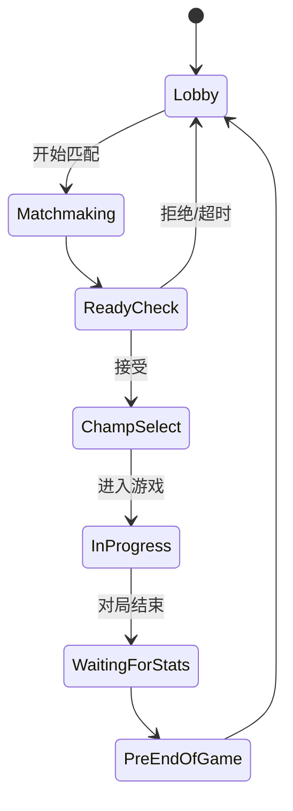
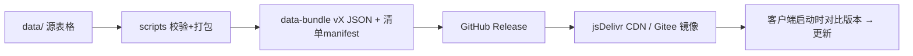
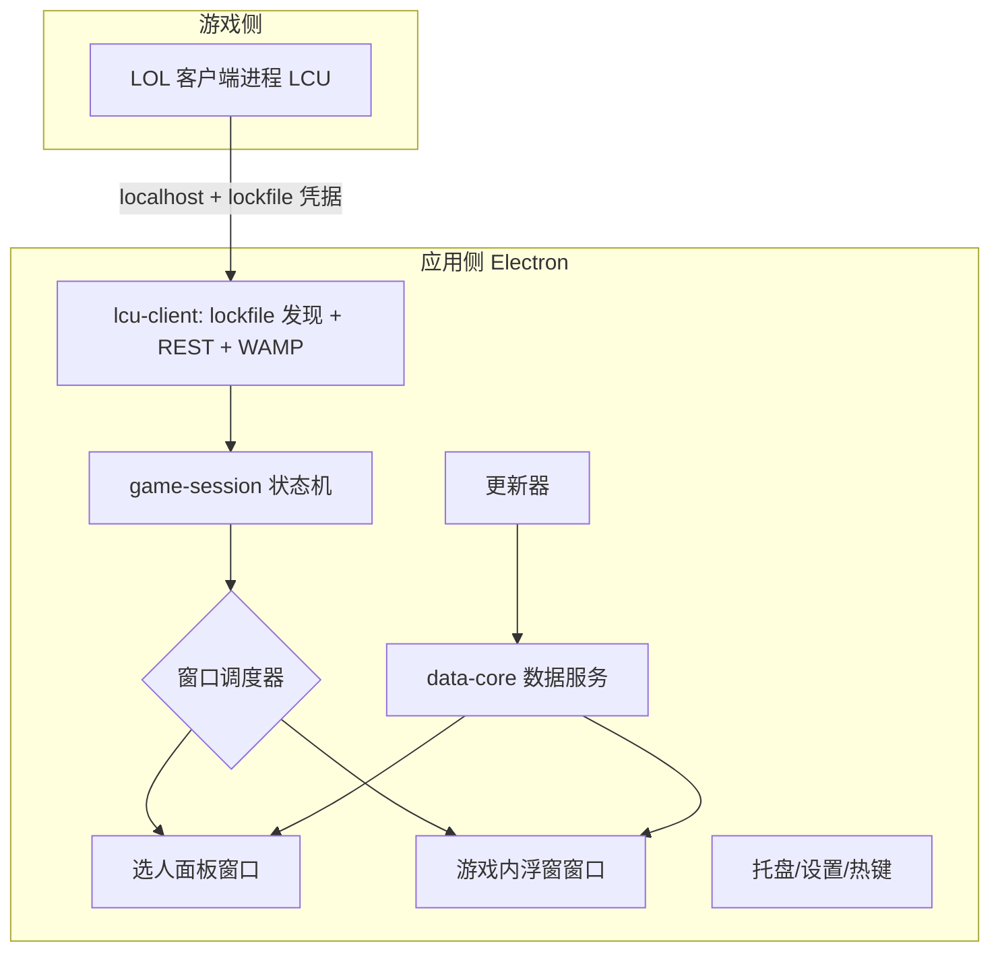

# ChooseHextech — 海克斯大乱斗辅助助手 · 设计文档（开发依据版）

- 版本：v1.0（已确认，作为开发依据）
- 项目名：**ChooseHextech**
- 平台：仅 Windows
- 目标用户：国服英雄联盟玩家（海克斯大乱斗模式）
- 开源协议：代码 **MIT** + 数据 **CC BY-SA 4.0**
- 定位：开源、免费、只做"静态参考信息展示"的辅助工具

---

## 1. 项目概述

### 1.1 背景与关键事实

「海克斯大乱斗」是《英雄联盟》的限时模式（大乱斗 + 海克斯强化符文体系）。该模式英雄随机、强化符文数量多、与常规模式出装思路差异大。

**已确认的关键玩法事实（决策 #1）**：海克斯强化符文在**进入游戏后**选择，而非选人阶段。因此：

- **选人界面面板**的职责是"预研"：玩家拿到随机英雄后，立刻看到该英雄有哪些适配套路、各套路配套的海克斯推荐、装备推荐与对局技巧，提前规划好进游戏后要点什么符文。
- **游戏内浮窗**的职责是"查阅"：玩家在游戏内遇到海克斯选择时，热键唤出浮窗照着推荐选，同时可查装备顺序与技巧。

现有主流工具（op.gg、WeGame、各数据站）基本没有覆盖该模式的专属数据，存在空白窗口期。

### 1.2 目标

1. **选人界面**：自动识别当前己方英雄，展示该英雄的常见套路（海克斯推荐、装备推荐、对局技巧），支持手动搜索任意英雄（含队友/对手）。
2. **游戏内浮窗**：可自由开关的置顶浮窗，默认展示**海克斯推荐**（游戏内的主要用途），可切换查看套路、装备、技巧；可拖动、可点击穿透、记忆位置。
3. **数据生态**：数据格式简单（`英雄-套路名-海克斯推荐-装备推荐-对局技巧`），社区可通过 PR 低门槛贡献；客户端支持在线更新。
4. **开源发布**：GitHub 开源（MIT 代码 + CC BY-SA 4.0 数据），透明、可审计、可自构建。

### 1.3 非目标（明确不做）

- ❌ 不读取游戏内存、不注入游戏进程、不自动化任何操作（含自动选人/自动点符文）。
- ❌ 不提供实时对局信息类功能（大招计时、野怪计时、敌方位置提示等）。
- ❌ 不做商业变现、广告、账号体系。
- ❌ 首版不做战绩统计、胜率分析等需要数据源的扩展功能（列为远期可选）。
- ❌ 首版不做英文/多语言（决策 #6）。

---

## 2. 领域模型与术语

### 2.1 术语表

| 术语 | 说明 |
|---|---|
| 英雄 Champion | 由官方 championId（如 `Ahri`）唯一标识；展示名以国服译名为准 |
| 套路 Build | 一种玩法流派（如"AP 消耗流""攻速特效流"），一个英雄可有多个套路 |
| 海克斯强化 Hextech Augment | 该模式的强化符文，**游戏内分阶段选择**；数据首版为自由文本列表，预留分层结构 |
| 装备 Item | 官方装备，按官方 ID 解析图标与名称 |
| 技巧 Tips | 对局技巧，每条一句，可多选一展示 |
| 对局阶段 Gameflow Phase | 客户端状态机阶段（见 2.2） |
| 数据包 Data Bundle | 校验、打包后的版本化数据文件，随版本发布 |

### 2.2 对局生命周期状态机



- 工具只做**观察者**：订阅客户端状态变化，在不同阶段展示/隐藏对应界面，绝不回写任何操作。
- **InProgress 内部阶段不可感知**：我们不读取游戏状态，无法知道游戏内"海克斯选择时刻"何时到来。浮窗因此设计为"随时可热键唤出、默认停在海克斯推荐页"，玩家在游戏内选择海克斯时自行唤出对照。这是合规约束下的刻意取舍（见第 8 章）。

---

## 3. 功能需求

### 3.1 FR1 — 选人界面面板

| 编号 | 需求 | 优先级 |
|---|---|---|
| FR1.1 | 通过 LCU API 自动检测进入选人阶段（ChampSelect） | Must |
| FR1.2 | 自动识别当前己方英雄，立即展示其套路列表 | Must |
| FR1.3 | 每个套路展开显示：海克斯推荐、装备推荐、对局技巧 | Must |
| FR1.4 | 手动搜索框：查询任意英雄（覆盖队友、对手、重roll后未选情况） | Must |
| FR1.5 | 支持套路切换（点击切换，记住上次选择的套路） | Should |
| FR1.6 | 支持"随机摇人"场景：大乱斗式选人含 bench/重roll，面板需在英雄变更时自动刷新 | Must |
| FR1.7 | 面板窗口可拖动、可关闭、可固定在屏幕一侧 | Should |
| FR1.8 | 应用启动即显示面板：客户端未连接时显示未连接状态（搜索可用），客户端连接后自动追踪当前英雄；始终可见直到用户关闭 | Must |
| FR1.9 | 面板顶部提示："海克斯强化在游戏内选择，先看推荐做好规划" | Should |

### 3.2 FR2 — 游戏内浮窗

| 编号 | 需求 | 优先级 |
|---|---|---|
| FR2.1 | 全局热键开关浮窗（默认建议 `Ctrl+Shift+H`，可自定义） | Must |
| FR2.2 | 浮窗置顶显示于游戏之上（要求游戏使用无边框/窗口化全屏，README 引导） | Must |
| FR2.3 | 浮窗默认展示**海克斯推荐**分区（游戏内选择符文时的主要用途），可切换到装备推荐、对局技巧 | Must |
| FR2.4 | 点击穿透：不遮挡游戏操作；鼠标悬停时临时进入可交互态 | Must |
| FR2.5 | 可拖动，位置记忆（按显示器/分辨率记忆） | Must |
| FR2.6 | 透明度可调；热键切换套路、在海克斯/装备/技巧三个分区间切换 | Should |
| FR2.7 | 英雄快捷切换：游戏内可手动切换到任意英雄（兜底方案，见 6.3.4） | Should |
| FR2.8 | 游戏结束（对局阶段离开 InProgress）自动隐藏 | Should |

### 3.3 FR3 — 数据管理与更新

| 编号 | 需求 | 优先级 |
|---|---|---|
| FR3.1 | 内置离线数据包，无网络也可用 | Must |
| FR3.2 | 启动时检查数据更新（GitHub Release / CDN），提示并一键更新 | Must |
| FR3.3 | 数据带版本号与适用游戏版本号，过期数据显示提醒 | Should |
| FR3.4 | 数据损坏/缺失时降级：显示错误而非崩溃，可一键重新下载 | Must |

### 3.4 FR4 — 系统与设置

| 编号 | 需求 | 优先级 |
|---|---|---|
| FR4.1 | 设置页：热键、透明度、面板位置、开机自启、数据更新源 | Should |
| FR4.2 | 系统托盘常驻，可快速开关各窗口（M1 已实现基础版：图标 + 显示/隐藏 + 退出） | Should |
| FR4.3 | 多显示器支持 | Should |
| FR4.4 | 日志记录（本地文件，仅用于排障，不上传） | Should |

### 3.5 FR5 — 开源协作

| 编号 | 需求 | 优先级 |
|---|---|---|
| FR5.1 | 贡献指南：如何新增/修改英雄数据（非程序员可操作） | Must |
| FR5.2 | CI 自动校验所有数据 PR，错误时自动反馈 | Must |
| FR5.3 | 数据 PR 模板 + 审阅流程 | Should |
| FR5.4 | 项目 README 明确合规声明与免责声明 | Must |

---

## 4. 数据设计

### 4.1 源数据格式（作者友好，保持你给定的格式）

数据以 **TSV/CSV 表格**形式存放在 `data/` 目录，一行一个套路，列结构：

```
英雄  套路名  海克斯推荐  装备推荐  对局技巧  作者  适用版本
阿狸  AP消耗流  能量汲取、技能急速、法术强度上限+  卢登的伙伴、影焰、灭世者的死亡之帽  前期用Q消耗……；中后期跟队友集火  小A  25.24
```

约定：
- `海克斯推荐`、`装备推荐` 用中文顿号 `、` 分隔；`对局技巧` 用全角分号 `；` 分隔多条。
- 同一英雄多个套路 = 多行。
- 名称以**国服译名**为准（`data/generated/aliases.csv` 维护"国服译名 → 官方 championId"映射，由 `scripts/gen-all-champions.ts` 从 LCU 英雄目录生成，用于取图标与识别）。
- 纯中文，无英文列（决策 #6）。
- 可选扩展列（预留，首版不用）：`套路标签`（上分/娱乐/整活）、`海克斯分层`（按稀有度分组）。
- **首批范围（决策 #3）**：10 个热门英雄。参考候选（ARAM 常见强角，最终以你提供的数据为准）：希维尔、金克丝、卡莎、艾希、拉克丝、维克兹、泽拉斯、火男、提莫、卡特琳娜。

### 4.2 内部 Schema（构建产物，客户端消费）

构建脚本把表格编译为版本化 JSON 包：

```json
{
  "schemaVersion": 1,
  "dataVersion": "2025.12.1",
  "gamePatch": "25.24",
  "mode": "hextech-aram",
  "champions": [
    {
      "championId": "Ahri",
      "nameZh": "阿狸",
      "builds": [
        {
          "name": "AP消耗流",
          "hextech": ["能量汲取", "技能急速"],
          "items": ["卢登的伙伴", "影焰"],
          "tips": ["前期用Q消耗", "中后期跟队友集火"],
          "author": "小A",
          "updatedPatch": "25.24"
        }
      ]
    }
  ]
}
```

设计要点：
- 名称为主键，ID 在构建期解析为 `championId`，名称对不上时 CI 报错（而非运行期静默失败）。
- `schemaVersion` 保证向后兼容；新增字段一律可选项，不破坏老客户端。
- 装备与海克斯名称按国服译名直接存文本（首版不依赖第三方 ID 表，解析失败风险最小）。

### 4.3 ID 与资源解析（图标/图片）

- **英雄/装备图标**：构建期从 Data Dragon（`ddragon.leagueoflegends.com`，Riot 官方社区资源服务，locale=zh_CN）拉取并**运行时按需加载+本地缓存**，**不把 Riot 素材提交进开源仓库**，避免版权问题。
- **海克斯强化符文**：不在 Data Dragon 内，首版以纯文本展示；后续由社区维护"符文名 → 图标"映射表，同样仅存映射不存图片。

### 4.4 数据版本与分发



- 主通道：GitHub Release 附 `data-{version}.json` + `manifest.json`（含 SHA-256 校验）。
- 国内加速：jsDelivr 拉 GitHub 资源（国内可达）；可选 Gitee 仓库镜像。
- 客户端：本地缓存 + 离线可用 + 哈希校验，下载失败回退旧包。

### 4.5 校验规则（CI 强制执行）

- 每行字段非空；英雄名在官方英雄表内；装备名在官方装备表内。
- 同一英雄下套路名不重复；技巧条数 ≥ 1；单条技巧长度上限（60 字）。
- 数据变更必须注明适用版本；合并前自动跑全量校验并附预览。

---

## 5. 技术选型

### 5.1 方案对比（仅 Windows）

| 维度 | Electron + TypeScript | Tauri 2 + TS 前端 | .NET 8 WPF (C#) |
|---|---|---|---|
| 浮窗能力（透明/置顶/穿透） | ✅ 成熟，`setIgnoreMouseEvents` | ✅ 原生窗口 | ✅ 最强（WS_EX_TRANSPARENT） |
| 体积/内存 | ⚠️ 约 100–150MB，内存较高 | ✅ 10–20MB | ✅ 极小 |
| LCU 集成 | 现成 JS/TS 封装可参考 | 需 Rust 写 WebSocket | 现成库多（Pyke、lcu-sharp） |
| 社区贡献面 | ✅ 最大（前端开发者最多） | 🟡 需会 Rust 才能动后端 | 🟡 C# 圈 |
| 你的上手成本 | ✅ 低（与当前环境一致） | 🟡 中 | 🟡 中高 |
| 签名/杀软误报 | ⚠️ 常见，需文档引导 | ✅ 较少 | ✅ 较少 |

### 5.2 推荐（已定）

**Electron + TypeScript**：浮窗能力足够（Porofessor/Blitz 类工具同路线）、与你的技能栈一致、迭代最快、开源贡献者池最大。仅 Windows（决策 #2），无跨平台包袱。若后续对体积敏感，再评估迁移 Tauri 2（前端可复用）。

**Monorepo 建议结构**（pnpm workspace，仓库名 ChooseHextech）：

```
choosehextech/
├─ apps/
│  ├─ desktop/              # Electron 主进程 + preload
│  └─ web/                  # 数据浏览/文档站（后期可选）
├─ packages/
│  ├─ lcu-client/           # LCU API 客户端：lockfile、REST、WAMP 订阅
│  ├─ game-session/         # 对局状态机（纯 TS，可单测，与 Electron 解耦）
│  └─ data-core/            # schema、校验、解析、版本比较（纯 TS，可复用）
├─ data/                    # 数据源
│  ├─ champions.tsv         # 主数据表（社区直接编辑）
│  ├─ meta/                 # 手工维护对照表（items.tsv、hextech.tsv、release.json）
│  └─ generated/            # 生成物（aliases.csv、champion-ids.csv，勿手改）
├─ scripts/                 # 数据管线（validate / build-data / gen-all-champions）
│  └─ dev/                  # 联调工具（inspect-lcu / probe-lcu / watch-champselect / gen-tray-icon）
├─ docs/
└─ tests/
```

UI 框架：**React + TypeScript**；状态管理用轻量方案（Zustand）。UI 文案直接写中文，不引入 i18n（决策 #6）。

**桌面端工具链（M1 落地细化）**：主进程/preload 与渲染层统一用 **electron-vite** 构建（渲染层 Vite + React，主进程打包时把 `@choosehextech/*` 工作区包以源码形式打入 bundle，`ws`/`zod` 等第三方依赖保持 external）；共享包 `data-core`/`game-session` 的纯逻辑部分（窗口策略、数据查询、数据加载）刻意保持零 Electron 依赖，可直接在 CI/受限环境单测。注意：构建（esbuild/Vite）与 GUI 运行在受限沙箱内不可用，需在开发者机器或 CI（GitHub Actions）执行，沙箱内以 tsc 类型检查 + 纯逻辑单测作为验证手段。

---

## 6. 系统架构

### 6.1 总体架构



### 6.2 模块职责

| 模块 | 职责 | 关键点 |
|---|---|---|
| `lcu-client` | 发现客户端（读安装目录 lockfile，`name:pid:port:password:protocol`），HTTPS 自签信任 + Basic Auth（`riot:密码`），REST 请求，WAMP WebSocket 订阅 `OnJsonApiEvent` | 客户端未启动时的状态与重试 |
| `game-session` | 状态机：gameflow-phase、当前英雄、队列 ID、champ select session（我方/对方、bench、交换） | 纯逻辑，注入 `lcu-client` 接口即可单测 |
| `data-core` | 数据包加载/解析/校验/版本比对 | 与 UI 无关 |
| 窗口调度器 | 按对局阶段显示/隐藏面板与浮窗 | 所有窗口行为集中一处 |
| 更新器 | manifest 比对、下载、SHA-256 校验、原子替换、回退 | 下载失败不动旧数据 |

### 6.3 LCU 集成要点

1. **关键接口**：
   - `GET /lol-gameflow/v1/gameflow-phase` → `Lobby | Matchmaking | ReadyCheck | ChampSelect | InProgress | WaitingForStats | PreEndOfGame | EndOfGame`
   - `GET /lol-champ-select/v1/session` → `myTeam[].championId`、`bench`、`actions`（pick/reroll）、`localPlayerCellId`
   - `GET /lol-summoner/v1/current-summoner`、`GET /lol-lobby/v2/lobby`（`gameConfig.queueId` 用于确认是海克斯大乱斗队列，队列 ID 需实测记录）
2. **实时性**：轮询（1–2s）+ WAMP 事件双通道，WAMP 断线自动降级为轮询。
3. **选人识别**：大乱斗式选人存在"随机获得 → 重roll → 与 bench 交换"流程，最终英雄可能与初选不同；面板需监听 session 变化实时刷新。
4. **游戏内英雄兜底**：进入 InProgress 后以"选人阶段最终确定的己方英雄"为准；若发生过交换无法确定，浮窗提供快捷英雄切换（搜索框），**不通过读内存解决**。
5. **安全边界**：只读 REST + 订阅事件，**永不调用任何写操作接口**（如锁英雄、换符文）。

### 6.4 浮窗实现要点（Electron）

- 窗口参数：`transparent: true, frame: false, alwaysOnTop: true, skipTaskbar: true, focusable: false`；`setAlwaysOnTop(true, 'screen-saver')` 保证在游戏上（游戏须为无边框/窗口化全屏，README 引导用户设置）。
- 点击穿透：`setIgnoreMouseEvents(true, { forward: true })`；鼠标移入浮窗时临时关闭穿透以操作 UI，移出恢复；提供"锁定"开关。
- 热键：`globalShortcut` 注册，与游戏内键位冲突检测提示，默认键避开常用键（如 `Ctrl+Shift+H`）。
- 显示器：记录所在显示器与相对坐标，多显示器/分辨率变化时修正位置；注意高 DPI 缩放。
- 默认内容页：浮窗唤出时默认停在**海克斯推荐**分区（游戏内主要用途，见决策 #1）。

### 6.5 配置与日志

- 配置：JSON 文件（`%APPDATA%/ChooseHextech/config.json`），含热键、窗口位置、透明度、更新设置。
- 日志：滚动文件，仅本地；README 说明日志路径与隐私范围（不采集账号、对局内容，仅程序自身运行信息）。

---

## 7. UI/UX 设计

### 7.1 选人面板

- 紧凑竖版卡片窗口（约 360×520），自动吸附在客户端侧边。
- 顶部：当前英雄头像 + 名称 + 套路切换标签页；搜索框常驻；顶部一行小字提示"海克斯强化在游戏内选择，先看推荐做好规划"。
- 中部：套路内容分区卡片——**海克斯推荐**（模式特色，放第一位）、**装备推荐**（图标+名称）、**对局技巧**（编号列表）。
- 底部：数据版本 + 过期提醒 + "反馈/纠错"链接（跳转 GitHub issue 模板）。

### 7.2 游戏内浮窗

- 默认更小（约 320×400）、半透明（默认 85%），内容与面板同构，弱化装饰。
- 默认停在**海克斯推荐**分区；热键（如 `Ctrl+Alt+1/2/3`）在海克斯/装备/技巧三区切换，避免鼠标离开游戏。
- 交互状态：默认穿透；悬停浮现顶部控制条（拖动区、关闭、锁定、透明度、切换套路、快捷搜索英雄）。

### 7.3 通用原则

- 所有展示均为"参考信息"，界面加一行小字：*内容由社区维护，仅供参考*。
- 深色半透明主题，贴合游戏客户端深蓝黑 UI 风格。
- 全中文文案，不引入 i18n 框架（决策 #6）。

---

## 8. 合规与安全（重点章节）

### 8.1 现状与红线

- Riot 官方"第三方程式"政策：第三方程序**自担风险**，禁止提供"可衡量的游戏优势"。
- **2025 年 3 月，Riot 明确封禁了"大招计时类悬浮窗"**（读取游戏内状态并实时提示敌方技能 CD 的工具），并配套 Vanguard 检测。这是本项目最重要的前车之鉴。
- 本项目定位必须且仅能为：**展示社区预先编写的静态攻略数据**。英雄信息来自选人阶段的客户端 API（不涉及游戏内实时状态），游戏内浮窗只展示"你在选人时已经确定的那份静态攻略"，不感知游戏内任何实时状态（含海克斯选择时刻）。
- 据此确立三条不可触碰的红线：
  1. **不读游戏内存、不注入、不 hook 游戏进程；**
  2. **不调用任何客户端写操作接口（不代玩家做任何选择）；**
  3. **不开发任何"由实时对局状态驱动"的提示功能（计时、走位、敌方动向等）。**
- 如未来 Riot 政策进一步收紧（例如禁止选人阶段读取 LCU），项目需能快速裁剪：面板与浮窗均退化为纯手动查询模式（去掉自动识别）。

### 8.2 素材与版权

- 英雄/装备图标：运行时经 Data Dragon 加载并缓存，**不随仓库分发 Riot 图片素材**；README 附 Riot 资产署名说明。
- 数据（套路/技巧）为社区原创事实性内容，与图片分离，采用 **CC BY-SA 4.0** 协议；代码采用 **MIT**（决策 #4、#5）。

### 8.3 免责声明

README 与安装包内醒目声明：
- 本项目非 Riot Games 官方产品，与 Riot 无关联；
- 使用第三方工具存在账号风险，请知悉 Riot 相关政策后自行决定是否使用；
- 项目承诺绝不包含内存读取/注入/自动化代码，且开源可审计；不接受任何引入上述能力的 PR。

---

## 9. 测试策略

| 层级 | 内容 |
|---|---|
| 数据层单测 | 全量数据校验（字段、重名、ID 映射、技巧长度）；坏数据降级行为 |
| 状态机单测 | 用录制的 LCU 会话回放（mock 数据）验证：进入/离开选人、重roll、bench 交换、进入游戏、对局结束 |
| UI 测试 | Playwright（支持 Electron）覆盖：面板展示、搜索、套路切换、浮窗开关/穿透/拖动 |
| 真机清单 | 真实客户端选人联动、无边框全屏下置顶、热键冲突、断网离线、数据更新回滚 |
| 回归 | 每次数据 PR 自动跑数据校验；每次代码 PR 跑单测 + 构建 |

---

## 10. 发布与分发

- **构建**：electron-builder 出 NSIS 安装包 + 便携 zip，GitHub Actions 自动构建发 Release。
- **自动更新**：electron-updater 对接 GitHub Release；数据更新走 manifest（见 4.4）。
- **代码签名**：无证书时 Windows SmartScreen 会告警——开源项目常见问题。策略：README 提供"仍要运行"指引 + 自构建教程 + VirusTotal 透明化链接；预算允许时购买代码签名证书（可选）。
- **国内可达性**：Release 下载页提供 Gitee 镜像；数据走 jsDelivr。
- **版本号**：语义化版本；数据包独立版本号（`dataVersion`），与客户端版本解耦。

---

## 11. 里程碑路线图

| 里程碑 | 范围 | 验收标准 |
|---|---|---|
| M0 数据奠基 | 定稿数据格式 + **10 个热门英雄**样例数据 + 校验脚本 | 样例数据通过全量校验 |
| M1 (v0.1) 选人面板 | Electron 壳 + lcu-client + game-session + 面板（自动识别+搜索+套路展示） | 真实客户端中选人阶段自动弹出并正确展示 |
| M2 (v0.2) 游戏内浮窗 | 浮窗 + 热键 + 穿透 + 拖动记忆 + 透明度 + 默认海克斯页 | 无边框全屏游戏中可开关、可拖动、不挡操作 |
| M3 (v0.3) 数据生态 | 打包管线 + 在线更新 + 设置页 + 托盘 | 新版本数据发布后客户端一键更新成功 |
| M4 (v1.0) 开源发布 | 贡献指南 + PR 模板 + CI + README/免责声明 + 发布流程 | 陌生人可按文档完成一次数据贡献并被 CI 校验 |
| M5+ 长期 | 数据众包爬坡、数据浏览站、可选统计功能 | — |

---

## 12. 风险与决策记录

### 12.1 风险表

| 风险 | 影响 | 缓解 |
|---|---|---|
| Riot 政策收紧（2025 封禁先例） | 功能被迫裁剪/停用 | 坚守第 8 章红线；架构上"自动识别"与"手动查询"解耦，可降级 |
| LCU API 无官方文档、随版本变动 | 识别失效 | lcu-client 独立成包、集中适配；社区 issue 跟踪 |
| Vanguard 误判 | 用户恐慌 | 零游戏进程交互的技术事实 + 开源审计 + 沟通预案 |
| 数据质量/更新不及时 | 项目口碑 | CI 校验 + 版本标记 + 过期提醒 + 低门槛贡献流程 |
| SmartScreen/杀软误报 | 安装门槛 | 签名（可选）+ 自构建教程 + VirusTotal 透明化 |
| 模式限时下架 | 用户流失 | 数据表预留 `mode` 字段，可平滑扩展普通大乱斗/其他模式 |

### 12.2 已确认决策记录

| # | 决策项 | 结论 | 影响章节 |
|---|---|---|---|
| 1 | 海克斯强化选择时机 | 游戏内选择；面板做"预研"、浮窗做"查阅"，浮窗默认海克斯页 | 1.1、2.2、FR1.9、FR2.3、6.4 |
| 2 | 平台 | 仅 Windows | 5、6.4 |
| 3 | 首批英雄 | 10 个热门英雄（候选清单见 4.1，以实际数据为准） | 4.1、11(M0) |
| 4 | 项目名 | ChooseHextech | 全文、6.5 配置路径 |
| 5 | 开源协议 | 代码 MIT + 数据 CC BY-SA 4.0 | 8.2 |
| 6 | 多语言 | 不需要英文列；UI 全中文，不引入 i18n | 1.3、4.1、5.2、7.3 |
| 7 | 面板显示时机（联调期变更） | 客户端连接后即显示，而非仅选人阶段 | FR1.8、apps/desktop/src/main/policy.ts |
| 8 | 启动可见性（联调期变更） | 应用启动即显示面板（未连接时显示未连接状态），不再因无客户端而隐藏 | apps/desktop/src/main/index.ts |
| 9 | 国服客户端发现（联调期实测） | 国服 WeGame 不写 LCU lockfile（只有启动器 Riot Client 的）；LCU 凭据可用三条通道获取并按序探活：① lockfile（仅接受 name=LeagueClient）② LCU 日志（LeagueClient*.log 中的 --app-port/--remoting-auth-token，本机 WMI 被安全策略拒绝故日志通道为实际主通道）③ LeagueClientUx 进程命令行（PowerShell/WMI 兜底） | packages/lcu-client/src/{lockfile,logs,process}.ts |
| 10 | 托盘 | M1 实现基础托盘（图标 + 显示/隐藏 + 退出），关闭面板=隐藏到托盘 | apps/desktop/src/main/index.ts、resources/tray.png |
| 11 | 国服 LCU 接口差异（联调期实测） | ① `/lol-gameflow/v1/gameflow-phase` 返回裸字符串（如 `"Lobby"`）而非 `{phase}` 对象 → `toPhaseDto` 兼容两种形态；② 召唤师名在 `gameName` 字段（displayName 为空）；③ 海克斯大乱斗 queueId 实测 = **3270**（gameMode=KIWI；普通大乱斗 450）→ `HEXTECH_ARAM_QUEUE_IDS` 已更新，桌面端目标队列过滤生效 | packages/game-session/src/{reducer,constants}.ts |
| 12 | 国服选人 session 与英雄目录（联调期实测） | ① 选人 session 的备选池字段名为 `benchChampions`（国际服为 `bench`），`localPlayerCellId` 为 0（国际服从 1 起）→ reducer 已兼容；② 英雄中文名权威来源 = LCU `/lol-game-data/assets/v1/champion-summary.json` 的 `description` 字段（玩家名），Data Dragon 的 zh_CN name 是称号不可用；该目录含 Jade_* 皮肤条目（id 60001+）需过滤 | packages/game-session/src/{reducer,types}.ts、scripts/gen-all-champions.ts |
| 13 | 套路单选查看（联调期定稿） | 面板套路标签单选：点击切换，同时只展示一个套路的海克斯/装备/技巧方案；曾短暂实现多选，按用户反馈改回单选 | apps/desktop/src/renderer/src/{App.tsx,components/ChampionPanel.tsx,lib/select.ts} |
| 14 | 海克斯图标 | 同名强化共用一张图；三级兜底：映射表（data/meta/hextech-icons.csv → CDN 图）→ 确定性占位 SVG（名字哈希色 + 首字）→ 加载失败回退占位；bundle 新增可选 `augmentIcons` 字段；客户端无海克斯图标资产接口（实测全 400）故不取官方图 | apps/desktop/src/renderer/src/lib/icons.ts、data/meta/hextech-icons.csv |
| 15 | 选人快捷查看 | 选人阶段面板顶部显示本局英雄头像栏（我/队友/备选池，按组着色；对手不显示，仍可搜索框查询），点击即切换查看该英雄的套路；状态机新增 teammateChampionIds/enemyChampionIds；头像取 Data Dragon（失败回落占位图） | packages/game-session/src/{types,reducer}.ts、apps/desktop/src/renderer/src/{App.tsx,components/ChampionQuickBar.tsx,lib/select.ts,lib/icons.ts} |
| 16 | 英雄头像映射 | bundle 新增可选 `championIcons`（英雄名 → 头像 URL，来自 data/meta/champion-icons.csv，爬取国服头像直链）；解析链：爬取 URL → Data Dragon → 占位图；面板头部与快捷栏统一使用；已接入 173 条国服头像（171/172 命中） | apps/desktop/src/renderer/src/lib/icons.ts、data/meta/champion-icons.csv |
| 17 | 游戏内浮窗（M2 初版，已被 #18 重构） | 初版为分区制浮窗（海克斯/装备/技巧单页 + 热键切换），后按用户要求重构 | — |
| 18 | 浮窗重构（M2 定稿，交互二次修订） | 游戏内浮窗与面板**同构**：直接复用面板组件（状态栏/搜索/快捷栏/套路标签/三区块堆叠）；游戏开始默认在屏幕左侧显示收起按钮（56×150 竖排），左键点击展开为 390×640 浮窗（默认穿透、悬停可交互）；**鼠标移出浮窗 0.5 秒延迟后自动收回为按钮**（期间移回则取消），解决展开后点回游戏无法再操作的死锁；每次浮窗重新显示自动回到收起态；热键仅保留 Ctrl+Shift+H 完全隐藏/显示；位置/透明度持久化 | apps/desktop/src/main/index.ts、src/renderer/src/{App.tsx,OverlayApp.tsx,lib/overlay.ts} |
| 19 | 游戏内数据与交互修订 | ① 快捷栏改为网格布局（一行 5 个自动换行，去横向滚动）；② 队友/对手信息跨阶段保留到游戏内（离开选人不清理，回大厅/新选人才重置），游戏内快捷列表 = 我+队友（无备选池）；③ 渲染层启动时主动拉取当前状态（state:get），修复窗口加载前错过首发状态消息导致游戏内显示「未连接客户端」的竞态 | packages/game-session/src/reducer.ts、apps/desktop/src/renderer/src/{App.tsx,lib/select.ts,styles.css}、preload/index.ts |
| 20 | 状态文案修正（联调期实测） | 客户端停在主界面时 gameflow-phase 为 `None`（已连接但未进入任何流程），此前被误显示为「未连接客户端」；修正：session 为空才显示「未连接客户端（自动重连中）」，phase=None 显示「已连接客户端 · 待命」 | apps/desktop/src/renderer/src/App.tsx |
| 21 | 顶部状态栏改版 | 顶部改为左右两区：**左上**显示已连接召唤师名字 + 状态点（绿点=客户端已连接并带呼吸动画，红点=未连接）；**右上**显示详细状态（阶段 + 队列类型/ID + 当前英雄名），未连接时显示「未连接客户端 / 正在自动重连客户端…」。召唤师名字来自 `/lol-summoner/v1/current-summoner`（displayName 优先，回落 gameName/internalName），随轮询并入 SessionState | packages/game-session/src/{types,reducer,tracker}.ts、apps/desktop/src/renderer/src/{App.tsx,styles.css} |

---

## 13. 额外建议（汇总）

1. **抓住窗口期**：主流工具尚未覆盖海克斯大乱斗数据，这是开源项目最稀缺的差异化点——尽快把 v0.1（哪怕只有选人面板）发布出去。
2. **数据众包决定成败**：工具的护城河不是技术而是数据新鲜度。贡献流程要做到"非程序员 10 分钟能提交一条数据"，CI 即时反馈 + 维护者审阅。后期可加 GitHub Pages 网页编辑器。
3. **覆盖冷门英雄 > 优化热门英雄**：首批 10 个热门英雄用于跑通流程，站稳后众包阶段宣传可主打"冷门英雄也敢玩"。
4. **浮窗是体验难点，别在 M1 就做**：按路线图先面板后浮窗，每个里程碑独立可发布。
5. **合规写进项目基因**：在 README 顶部、CONTRIBUTING、PR 模板三处都声明红线，防止热心的贡献者把"自动点符文"之类的功能提进来。
6. **保留扩展性但别做**：`mode` 字段、海克斯分层、套路标签留好位，v1.0 前不做；多语言已明确不做。
7. **国内分发细节**：Gitee 镜像 + jsDelivr 能显著改善国服玩家下载体验；SmartScreen 引导文档务必图文并茂。
8. **游戏内海克斯体验**：浮窗默认海克斯页 + 一键切换分区是核心体验，务必在 v0.2 打磨到位，这是本工具区别于普通出装查询工具的关键点。

---

## 14. 开发启动清单（M0 → M1 具体任务）

> 本节用于直接指导开发排期，按依赖顺序执行。

### M0 数据奠基

1. 初始化仓库：pnpm workspace 骨架（`apps/desktop`、`packages/{lcu-client,game-session,data-core}`、`data/`、`scripts/`、`tests/`）。
2. 写 LICENSE（MIT）与 DATA-LICENSE（CC BY-SA 4.0）双协议文件，README 占位（含合规声明骨架）。
3. `packages/data-core`：定义 TSV 列定义、解析器、JSON Schema（TypeScript 类型 + zod 校验）、校验规则（对应 4.5）。
4. `data/champions.tsv`：录入样例数据（已由 `scripts/gen-all-champions.ts` 生成全英雄占位数据）；`data/generated/aliases.csv` 维护国服译名 → championId（生成物）。
5. `scripts/validate.ts`：全量校验；`scripts/build-data.ts`：打包 `data-{version}.json` + manifest（M0 末可只做本地产物，在线分发 M3 再做）。
6. 单测：`tests/data.test.ts` 覆盖正常样例与各类坏数据用例。
7. 验收：`pnpm validate` 全绿。

### M1 选人面板（v0.1）

8. `packages/lcu-client`：lockfile 发现 + 自签信任 + Basic Auth + REST + WAMP 订阅，附本地 mock 服务器（`tests/mock-lcu`，回放录制会话）。
9. `packages/game-session`：gameflow 状态机 + champ-select session 解析（含重roll/bench 交换处理），纯函数 + 单测。
10. `apps/desktop`：Electron 壳 + 托盘 + 窗口调度器；选人面板 UI（React）：英雄卡片、套路标签页、海克斯/装备/技巧分区、搜索框。
11. 集成：真实客户端联调（选人阶段自动弹出、重roll 刷新、搜索任意英雄）。
12. 验收：FR1.1–FR1.6 全过。

### M2 游戏内浮窗（v0.2）

13. 浮窗窗口（透明/置顶/穿透/拖动记忆/透明度）+ 全局热键（开关、三区切换、套路切换）。
14. 浮窗默认海克斯页 + 悬停控制条 + 游戏内快捷搜索英雄。
15. 真机验收：无边框全屏下置顶、不挡操作、热键无冲突。

### 开发原则

- `game-session` 与 `data-core` 保持纯 TypeScript、零 Electron 依赖，全部逻辑可脱离桌面环境测试。
- 每个 PR 跑：数据校验 + 单测 + 构建；数据 PR 与代码 PR 走同一 CI 但分开 review 模板。
- 先实现"手动查询模式"（搜索框即可用），再接"自动识别"——自动识别失效时手动模式是天然降级路径。

---

## 15. 开发进度记录

| 里程碑 | 状态 | 说明 |
|---|---|---|
| M0 数据奠基 | ✅ 完成 | 仓库骨架、双协议、data-core（解析/校验/schema/打包）、10 英雄占位数据、CI；validate/test/typecheck/build:data 全绿 |
| M1 逻辑层 | ✅ 完成 | lcu-client（lockfile、REST、WAMP，协议自适应 https/http）+ game-session（reducer + SessionTracker，双通道：轮询+事件）+ tests/mock-lcu 模拟服务器；26 项测试全绿 |
| M1 桌面端 | ⏳ 进行中 | Electron 壳 + 窗口调度器 + 选人面板 UI（React，electron-vite）代码已落库并通过 typecheck；窗口策略/数据查询/数据加载纯逻辑 9 项单测全绿（全套 35 项）；Electron 二进制已下载；待开发者机器运行 `pnpm --filter @choosehextech/desktop dev` 做 GUI 验收；托盘推迟（FR4.2，M3 与设置页一并做） |
| M2 游戏内浮窗 | ⏳ 代码完成，待真机验收 | 浮窗窗口（透明/置顶/穿透/拖动记忆/透明度）+ 热键（Ctrl+Shift+H 开关、Ctrl+Alt+1/2/3 分区、Ctrl+Alt+←/→ 切套路）+ 悬停控制条 + 默认海克斯页；配置落 %APPDATA%/ChooseHextech/config.json |
| M3 数据生态 | ⬜ 未开始 | — |
| M4 开源发布 | ⬜ 未开始 | — |

**真机联调待办清单（M1 桌面端阶段）**：

0. 【已确认】lockfile 仅在客户端运行时存在；开发者机器实测：无 League/Riot 进程时 `D:\WeGameApps` 仅含 `common_apps`，游戏本体安装路径未知 → 客户端启动后从进程路径（`Get-Process`）获取真实安装目录并补进 `lcu-client` 的 `defaultInstallDirs()`。
1. 【已完成】海克斯大乱斗真实队列 ID 实测 = **3270**（gameMode=KIWI，普通大乱斗 450），已写入 `HEXTECH_ARAM_QUEUE_IDS` 并启用目标队列过滤。
2. 【已完成】国服客户端安装路径确认：`D:\Software\WeGameApps\英雄联盟`（LCU 在 `LeagueClient\`，游戏在 `Game\`，无 LCU lockfile，凭据走日志/进程命令行通道）。
3. 验证选人阶段 session 数据结构（重roll、bench 交换时 championId 变化是否符合 reducer 假设）。
4. 按 FR1.1–FR1.6 逐项验收。

**联调分工（已澄清）**：逻辑层真机验证（lockfile 发现、REST/WAMP 连通、状态机行为、队列 ID 记录）由本环境用 `pnpm inspect`（`scripts/dev/inspect-lcu.ts`，只读）完成，客户端由开发者启动即可；GUI 视觉验收（面板外观、窗口行为、挡不挡操作）由开发者肉眼完成。

**联调期变更记录**：面板显示时机由「仅选人阶段」改为「客户端连接后即显示」（决策 #7）；随后因无托盘导致应用启动后完全不可见，改为「应用启动即显示面板」（决策 #8）；国服真机联调发现 WeGame 客户端不写 LCU lockfile、且本机 WMI 被安全策略拒绝，最终以「LCU 日志解析」为主通道、进程命令行与 lockfile 为辅的发现链（决策 #9），并实现托盘（决策 #10）；真机实测国服接口差异（裸字符串 phase、gameName 字段、queueId=3270），已兼容并记录（决策 #11）；选人阶段实测确认 benchChampions/cellId=0 差异，并用 LCU 英雄目录生成**全英雄占位数据**（172 英雄，含 10 个手工样例），至此选人阶段任何随机英雄都能在面板中展示（决策 #12）。当前 42 项测试全绿，M1 功能验收完成，待启动 M2。

**数据 schema 演进记录**：M1 起 bundle 的 champion 条目新增可选字段 `numericId`（LCU 数字英雄 ID，来自 `data/generated/champion-ids.csv`），用于桌面端把对局状态映射到数据条目；`schemaVersion` 保持 1（新增可选字段向后兼容）。占位阶段该表由 `scripts/gen-all-champions.ts` 从 LCU 英雄目录生成全量。

**结构优化记录（M2 启动前）**：设计文档移入 `docs/`；联调工具归入 `scripts/dev/`（inspect-lcu / probe-lcu / watch-champselect / gen-tray-icon）；生成物（aliases.csv / champion-ids.csv）移入 `data/generated/` 与手工数据（champions.tsv、meta/）分离；新增 `data/README.md` 说明数据目录分工。套路查看最终定稿为单选（决策 #13，曾短暂实现多选，按用户反馈改回）。

**本机开发环境备忘（已写入 README）**：本机受限沙箱禁止子进程管道通信，因此：脚本/测试用 Node 22 原生类型擦除（`--experimental-strip-types`）直接运行，不依赖转译器与 test runner 子进程；依赖安装用 `pnpm install --ignore-scripts`；代码不得使用不可擦除语法（enum、namespace、构造器参数属性）。CI（GitHub Actions/Linux）无此限制。
